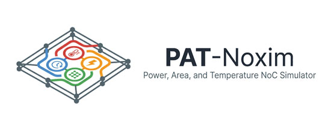

# PAT-Noxim - the NoC Simulator

Welcome to the PAT-Noxim, cycle accurate Network-on-Chip(NoC) simulator.

## Description

Networks-on-Chip (NoCs) have proven to be a low-latency and highly scalable in many-core architectures. Due to the importance of scalability, designers try to optimize latency, power and temperature across the network. Therefore, developing a precise tool to calculate the aforementioned attributes is of utmost importance. Designers need to evaluate their proposed techniques in a NoC simulated environment. So, we propose PAT-Noxim to address the shortcomings in design and post-design stages. PAT-Noxim, developed based on Access-Noxim, provides an environment to simulate a NoC in power consumption, area, delay and temperature models.

PAT-Noxim utilizes a power and thermal model that takes into account the effects of both the NoC traffic and the surrounding environment. The model is highly configurable, allowing users to adjust a range of parameters and settings to reflect their specific use cases.

The results of experiments conducted using PAT-Noxim demonstrate its effectiveness in accurately modeling power consumption and thermal behavior in NoCs. The simulator can be used to identify and address potential issues related to power and thermal management in NoCs, leading to improved system performance and reliability. Overall, PAT-Noxim represents a significant step forward in the field of NoC simulation and has the potential to be a valuable tool for researchers and practitioners alike.

PAT-Noxim is developed to support several predefined and custom architectures. it can be downloaded under GPL license terms.

**Code Documentation and Comments:**

PAT-Noxim distinguishes itself from other NoC simulators through its comprehensive in-code documentation. The source code contains extensive comments and explanations throughout all major components, making it significantly more accessible to developers and researchers. These comments provide detailed explanations of algorithms, data structures, signal connections, and implementation details that are typically absent in other simulators. This level of documentation facilitates understanding of the underlying mechanisms, enables easier modifications and extensions, and supports both educational and research purposes. Such comprehensive code documentation is a notable feature that enhances maintainability and usability compared to other available NoC simulation frameworks.

**If you use PAT-Noxim in your research, we would appreciate the following citation in any publications to which it has contributed:**

A. Norollah, D. Derafshi, H. Beitollahi and A. Patooghy, "PAT-Noxim: A Precise Power & Thermal Cycle-Accurate NoC Simulator," 2018 31st IEEE International System-on-Chip Conference (SOCC), Arlington, VA, USA, 2018, pp. 163-168. doi: [10.1109/SOCC.2018.8618491](https://doi.org/10.1109/SOCC.2018.8618491)

> Get in touch with me by [a.norollah.official@gmail.com](mailto:a.norollah.official@gmail.com)

## Structure

PAT-Noxim works with three different simulators in harmony to cover aforementioned models:

1. Orion 3.0 measures power consumption and area of routers by using orion model. We modified this simulator to work with PAT-Noxim.
2. McPAT calculates area and power consumption of different processing elements, implemented by designer.
3. Hotspot 6.0 receives area of routers and PEs from PAT-Noxim to calculate temperature more accurately than Access-Noxim.

## What's New?

Change list for the latest version of PAT-Noxim:

1. Adding virtual channels
2. Implementing several router architectures
3. Ability to change pipeline architectures such as 3-stage, 4-stage and 5-stage pipelines in runtime
4. Adding credit signals to each router
5. Improved power model for routers through Orion 3.0
6. Improved area model for routers through Orion 3.0 to measure temperature more accurately in Hotspot 6.0
7. Adding power and area models of several practical processors through McPAT
8. Updating power and area of NoC with each change in router architecture.
9. Adding support for 22, 32, 45, 65, 90 nm manufacturing technology.
10. Calculating leakage current by Temperature Effect Inversion (TEI), taking into account the initial leakage current
11. Measuring leakage current by TEI Through improved Orion 3.0
12. Obtaining temperature feedback from tiles to calculate leakage current by TEI in a specific time interval.
13. Increasing the accuracy of power and thermal measurements in sub-90 nm manufacturing technologies.
14. Report the chip surface temperature once every 100,000 cycles.
15. Comprehensive code comments and documentation throughout the source code to facilitate understanding and modification
16. Bug fixes

## How to Install

First, you need to install SystemC 2.2.0 (Follow the link: https://github.com/systemc/systemc-2.2.0)

1. Change to the top level directory (systemc-2.2)

2. Create a temporary directory, e.g.,

    $ mkdir objdir

3. Change to the temporary directory, e.g.,

    $ cd objdir
    $ sudo apt-get install tcsh
    $ tcsh
    $ setenv CXX g++

4. Configure the package for your system, e.g.,
   (The configure script is explained below.)

    $ ../configure

5. Compile the package.

    $ gmake
    $ gmake install
    $ cd ..
    $ rm -rf objdir
    $ exit

6. make sure directory "lib-linux" exist! if this name is "lib-linux64", rename it to "lib-linux".

To install the PAT-Noxim, you need to follow a few simple steps.

    $ cd PAT-Noxim/bin
    $ make
    $ make install

## Comprehensive Documentation

**We have created extensive documentation to help both users and developers!**

In addition to the detailed documentation files, PAT-Noxim features comprehensive inline code comments throughout the source code. Unlike many other NoC simulators that provide minimal or no code documentation, PAT-Noxim's source code contains extensive comments explaining data structures, algorithms, signal connections, and implementation details. This level of code documentation makes the simulator significantly more accessible to developers and researchers, enabling easier understanding, modification, and extension of the codebase.

All documentation is located in the **`docs/`** folder with the following guides:

### Quick Start Guides

- **[docs/INDEX.md](docs/INDEX.md)** - Navigation guide to all documentation
- **[docs/INSTALLATION.md](docs/INSTALLATION.md)** - Complete installation and setup guide
- **[docs/RUNNING_SIMULATIONS.md](docs/RUNNING_SIMULATIONS.md)** - Examples from basic to advanced simulations

### Configuration & Reference

- **[docs/CONFIGURATION.md](docs/CONFIGURATION.md)** - All configuration parameters and options
- **[docs/ARCHITECTURE.md](docs/ARCHITECTURE.md)** - System architecture and design overview

### For Developers

- **[docs/FILE_GUIDE.md](docs/FILE_GUIDE.md)** - Detailed description of each source file
- **[docs/DEVELOPER_GUIDE.md](docs/DEVELOPER_GUIDE.md)** - How to modify and extend PAT-Noxim
- **[docs/MODELLING.md](docs/MODELLING.md)** - Power (ORION) and Thermal (Hotspot) model details

### Key Files Quick Reference

| Files                      | Description                                                                                 |
| -------------------------- | ------------------------------------------------------------------------------------------- |
| NoximParameters.h          | All of the pre-compile settings are in this file (for PAT-Noxim, Orion and Hotspot)         |
| NoximMain.cpp              | Link the simulator to various components                                                    |
| NoximNoC.cpp               | Defines the overall structure of the network                                                |
| NoximRouter.cpp            | Router architectures includes. Routing algorithms are defined in this file                  |
| NoximProcessingElement.cpp | Includes the Processing Element(PE) architecture for sending and receiving messages         |
| NoximVLink.cpp             | Determines the policy of communication between the tiles in the third dimension             |
| NoximTile.h                | Defining and connecting components of a tile, consisting of the router and the PE           |
| NoximVCState.cpp           | Defines the virtual channel states on the router                                            |
| NoximPower.cpp             | The power consumption and the area of the network components are calculated in this section |

**For complete file descriptions, see [docs/FILE_GUIDE.md](docs/FILE_GUIDE.md)**

## Description of simulator components
